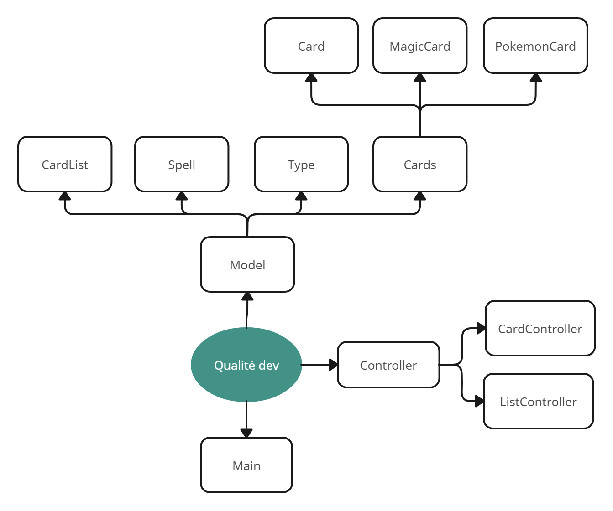

# Projet de Modélisation de Jeu de Cartes (TCG) Pokémon et Magic

## Contexte :

Ce projet vise à modéliser un jeu de cartes à collectionner (TCG) inspiré des univers de Pokémon et de Magic. Il donne la possibilité au joueur de créé son jeu de cartes, d'ajouter des cartes Pokémon ou Magic et d'afficher son jeu.

## Informations Techniques :

Le développement de ce projet a été réalisé en utilisant les technologies suivantes :

- Langage de programmation : Java
- Environnement de développement : IntelliJ IDEA

## Améliorations grâce au cours de Qualité de Développement :

Le cours de Qualité de Développement a été bénéfique pour améliorer plusieurs aspects techniques de ce projet. Voici trois points spécifiques sur lesquels nous avons pu progresser grâce à ce cours :

1. **Meilleure lisibilité du code avec des conventions communes :** En suivant des conventions de codage standard, telles que celles recommandées par Oracle pour Java, nous avons rendu le code plus facile à lire et à comprendre pour les membres de l'équipe. Cela facilite la collaboration et la maintenance du projet à long terme.

2. **Code plus propre et ordonné grâce à l'utilisation de branches :** En adoptant une approche de développement basée sur des branches Git, nous avons pu organiser le flux de travail de manière plus efficace.

3. **Utilisation de l'architecture Modèle-Vue-Contrôleur (MVC) :** L'application du modèle MVC a permis de structurer le code de manière modulaire et séparée en trois composants principaux : le modèle (représentant les données et la logique métier), la vue (gérant l'interface utilisateur) et le contrôleur (orchestrant les interactions entre le modèle et la vue). Cette approche favorise la maintenabilité, la réutilisabilité et la scalabilité du code.

## Journal de Bord :

Voici un aperçu des principales étapes réalisées dans le cadre de ce projet :

- Création des cartes Pokémon et Magic, en intégrant leurs caractéristiques spécifiques telles que les points de vie, les types, les attaques, etc.
- Mise en place de la fonctionnalité permettant d'imprimer les cartes, ce qui facilite leur visualisation et leur édition.
- Développement d'un contrôleur pour gérer les interactions entre les différents éléments du jeu, notamment les joueurs, les cartes et les événements de jeu.
- Mise en œuvre de l'architecture MVC pour organiser le code de manière structurée et maintenable.

Ce journal de bord sera continuellement mis à jour au fur et à mesure de l'avancement du projet, en incluant les nouvelles fonctionnalités développées et les éventuelles optimisations apportées au code.
